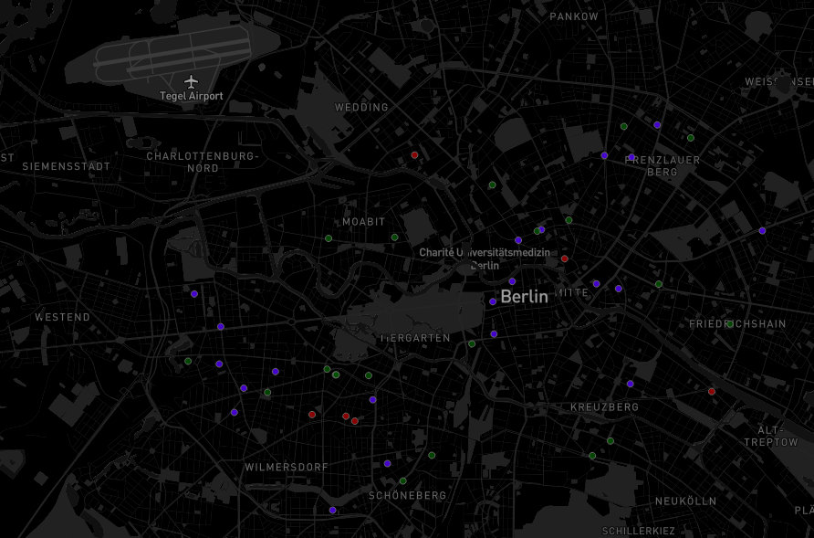
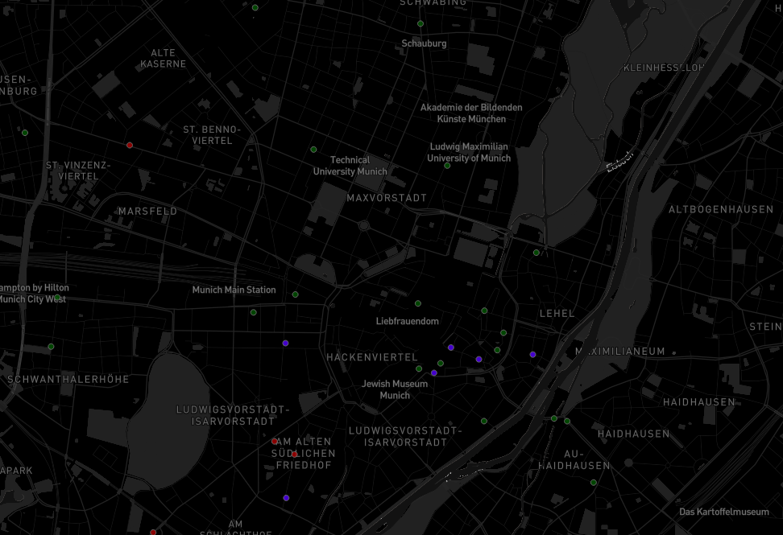
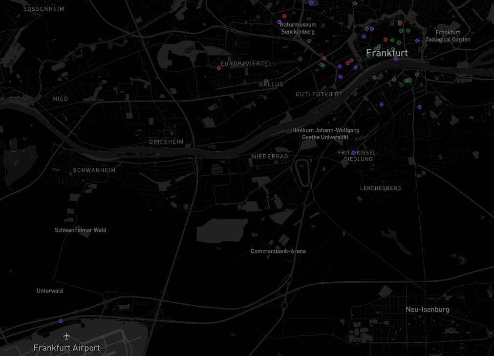
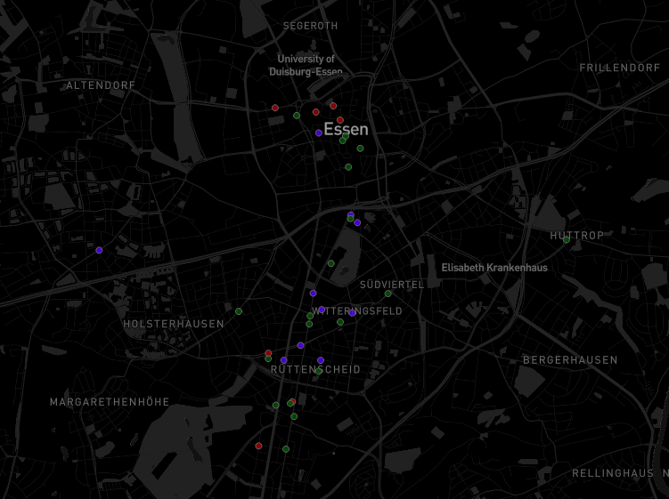
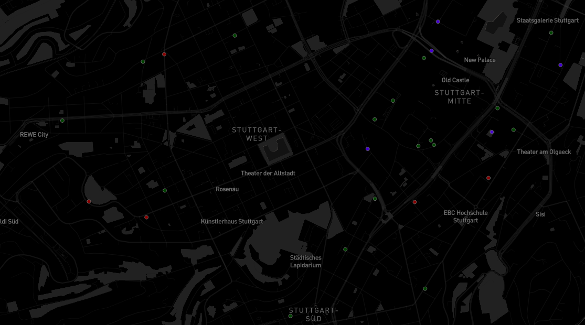
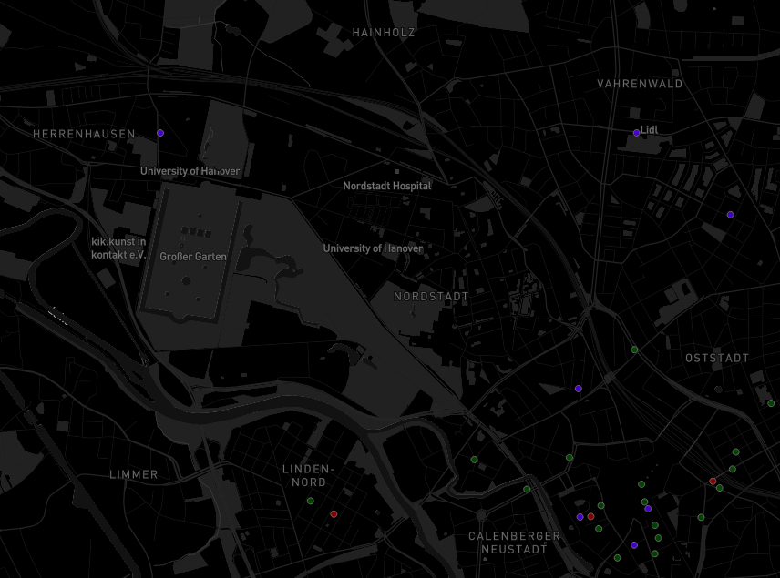

# Opening a restaurant in Germany
### Hypothesis: Suggesting top locations that could give some advantage.  
(Location is a key factor for opening any restaurant.)
 
### Data Available: Top 50 ranked restaurants of a city with some details 
(Using 2 APIs)
 

### Data Analysis: Data Transformation, finding useful information available, applying clustering algorithm and observing  
Transformed cuisine data for each restaurant into categories as it was available. Applying K-Mode clustering. 
Main clusters in the latest clustering:  
CLUSTER 0: most bar, most European, no Asian, most German, no Italian  
CLUSTER 1: most top ranked, most top rated, most cafe, most Healthy  
CLUSTER 2: no top ranked, least top rated, no bar, no cafe, no European, all Asian, no American, no German, no Mediterranean, no Italian  
CLUSTER 3: most bar, most steakhouse, least Gluten Free Options, least Healthy, most American  
CLUSTER 4: no bar, most seafood, no Asian, no American, most Medeterranean, most Italian  

KEY OBSERVATIONS  
* Cafes were most top rated
* Top ranked restaurants were mostly having healthy, seafood, Mediterranean, or Italian cuisines
* Bars were mostly German
* Asian cuisines were least ranked and least top rated

### Synthesis: Providing sensible suggestions with the observations made on the limited data available  
* Best options would be to open a cafe or restaurant with healthy/seafood/Mediterranean/Italian cuisines
* Bars would be a competitive market with local German and European cuisines
* Avoid or have less Asian cuisines

### After observing the clusters from the map:
Few suggestions based on demographic and competitions; ignoring budget, accessibility, crime, size and space requirements or other data that is not available  
Demographics: If your target audience consist of students then consider opening an inexpensive restaurant. 
Competition: If the area has more top rated and top ranked restaurants then either avoid or find a way to funnel the people to your location.  
Few examples of point of interests: 

 
1. Berlin  
A lot of the city has top class restaurants especially in the heart of the city. But near Tegel airport there is none. Might need to find a way to attract the audience from these other locations. 

 
2. Munich  
The triangular area formed by LMU (Ludwig Maximilian University of Munich), TU Munich (Technical University of Munich) and Munich Main Station. Could potentially attract students and other crowds to an inexpensive restaurant. 

 
3. Frankfurt  
Most of the city has top-class restaurants spread all over. Either avoid or find a way to funnel the people to your location. 

 
4. Essen  
Near University of Duisburg-Essen. Most are low rated/ranked near this location.  

 
5. Stuttgart  
Stuttgart West region has lack of top-class restaurants. 

 
9. Hannover  
Near University of Hannover. No top 50 restaurants located nearby.  

 
