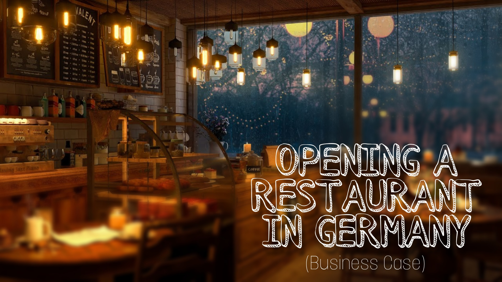

### Hypothesis  
Suggesting top locations that could give some advantage  
_(Location and cuisine types are key factors for opening any restaurant.)_
 
### Data   
Top 50 restaurants of a city with some details 
[Data Extraction & Data Transformation](https://github.com/s1dewalker/Opening-a-restaurant-in-Germany/blob/main/Data%20Extraction%20and%20Transformation.ipynb)  
_(2 APIs, Python)_ 

### Data Analysis  
[Exploratory Data Analysis](https://github.com/s1dewalker/Opening-a-restaurant-in-Germany/blob/main/SQLQuery.sql)  
_(SQL)_  
[Data Modeling](https://github.com/s1dewalker/Opening-a-restaurant-in-Germany/blob/main/Clustering.ipynb)  
_(K-Mode clustering, Python)_ 

### Synthesis  
* __Best option would be to open a cafe, steakhouse or a hybrid steakhouse cafe__
  * __Cafes had the highest average rating and steakhouse had the highest presence in top 1%__
  * __Both had similar competition in the lower end__
* __Only 3% of cuisines were Indian and one-third of them were in the top 1% (Highest)__<br/.

### Reporting and Visualization  
_(Power BI)_ 

### After observing the clusters from the map
_(Tableau)_
Few suggestions based on demographic and competition; ignoring budget, accessibility, crime, size and space requirements, or other data that is not available  

Demographics: If your target audience consists of students then consider opening an inexpensive restaurant. 
Competition: If the area has more top-rated and top-ranked restaurants then either avoid or find a way to funnel the people to your location.  

Few examples of points of interest: 
(purple: most top-ranked, most top-rated | red: C rated | green: others)
 
1. Berlin  
A lot of the city has top-class restaurants, especially in the heart of the city. But near Tegel airport there is none. Might need to find a way to attract the audience from these other locations. 

 
2. Munich  
The area around LMU (Ludwig Maximilian University of Munich), TU Munich (Technical University of Munich), and Munich Main Station. Could potentially attract students and other crowds to an inexpensive restaurant. 

 
3. Frankfurt  
Most of the city has top-class restaurants spread all over. Either avoid or find a way to funnel the people to your location. 

 
4. Essen  
Near University of Duisburg-Essen. Most are low-rated/ranked near this location.  

 
5. Stuttgart  
Stuttgart West region has a lack of top-class restaurants. 

 
6. Hannover  
Near the University of Hannover. No top 50 restaurants are nearby.  

 

__These are just some examples from the overview for a starting point. More data and research will be required for further steps.__
